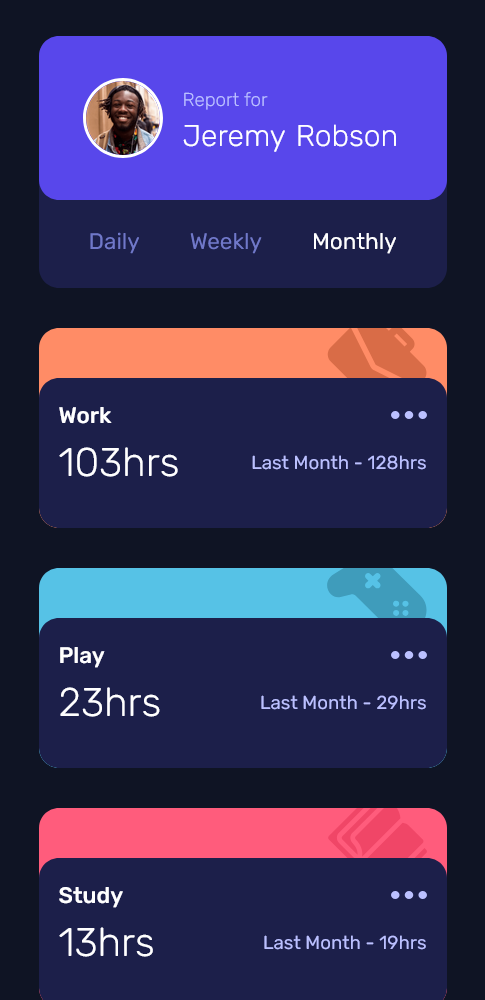

# Frontend Mentor - Time tracking dashboard solution

This is a solution to the [Time tracking dashboard challenge on Frontend Mentor](https://www.frontendmentor.io/challenges/time-tracking-dashboard-UIQ7167Jw). Frontend Mentor challenges help you improve your coding skills by building realistic projects. 

## Overview

This is one more challenge I solved on Frontendmentor platform.

### Screenshot

### Links

https://bojanognjen.github.io/Time-tracking-dashboard/

## My process

For the first time I used fetch API in Frontendmentor project. I encouraged to continue solving other projects.
I'm looking forward using third-party API's in following projects and developing many interesting apps.

### Built with

- Semantic HTML5 markup
- CSS custom properties
- Flexbox
- CSS Grid
- Mobile-first workflow

## Author

Bojan Lukic
bojan.ognjen@gmail.com

